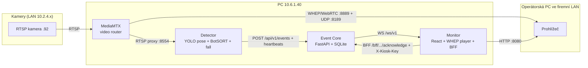

# ARCHITECTURE — logická architektura CableGuard

Last verified: 2026-07-27

Verified against:

- cableguard-platform `main` commit `5400cb3`
- cableguard-monitor `main` commit `f085ef0`
- cableguard-detector `main` commit `c628a2f`

---

## Cílová logická architektura

Stav integrace: video plane a event plane jsou CONFIRMED end-to-end; hrana **Detector → Event Core** je dnes pokryta simulátorem (`scripts/simulate_system.py`), reálný `EventCorePublisher` je na detector feature větvi (Phase 4).

## Čtyři plane — hlavní princip

### Video plane

**MediaMTX řeší pouze realtime video transport.** RTSP ingest z kamer, WHEP/WebRTC egress do prohlížečů, RTSP proxy pro detektor. Žádná detekční ani byznys logika.

### Detection plane

**Detector řeší AI inference a klasifikaci rizika.** YOLO pose → BotSORT tracking → fall risk score → událost. Numerická logika je zmrazená golden-master testy.

### Event plane

**Event Core řeší události, stav služeb, persistenci a acknowledgement.** Idempotentní ingest, SQLite persistence, WebSocket distribuce, heartbeat/offline monitoring.

### Presentation plane

**Monitor řeší pouze zobrazení a interakci operátora.** Video přijímá přímo z MediaMTX (ne přes Event Core), události přes WS, acknowledge přes BFF.

## Tvrdá pravidla (vynucená kódem a testy)

- **Video neprotéká přes Event Core** — Event Core nemá žádný video endpoint; nese jen metadata (`snapshot_url`, `clip_url`).
- **Inference neběží ve frontendu** — monitor nemá žádnou ML závislost.
- **MediaMTX nerozhoduje o pádu** — je to čistý media router.
- **Detector přímo neovládá frontend** — komunikuje výhradně přes Event Core kontrakt.
- **Frontend nemá secrets** — `verify-build-secrets.mjs` skenuje produkční build na `CABLEGUARD_*_API_KEY`, `X-Kiosk-Key`, `X-API-Key`, `rtsp://`.

---

## Architecture assessment (objektivní posouzení)

### Co je dobře

- **Oddělení čtyř plane je čisté a reálně dodržené.** Kontrakty (REST/WS/WHEP) jsou úzké a testované; každou část lze vyměnit nezávisle.
- **Idempotence na obou kritických operacích** (event ingest, acknowledge) — bezpečné retry pro detektor i operátora.
- **Golden-master ochrana algoritmu** — refaktoring runtime nemůže tiše změnit detekční chování.
- **Secrets model** je konzistentní: env/gitignored + build-scan.
- **Mock režim monitoru** umožňuje vývoj UI (i v Lovable) zcela bez backendu.

### Co je překombinované

- **Tři deployment režimy monitoru** (default/PROD-placeholder, dev, internal-lan) s netriviální resolucí `videoMode` — PROD build bez `internal-lan` tiše degraduje na placeholder, což už jednou způsobilo zmatek. Po Phase 5 by měl zůstat jediný produkční režim.
- **Množství overlapping PowerShell skriptů** (start/stop/status/patch/setup/verify/benchmark, ~17 v platformě) — vzniklé iterativně; část zastarává s draft PR. Konsolidace patří do Phase 6.
- **Duplicitní WHEP diagnostické skripty** v monitor repu (untracked `whep-*.mjs`) — jednorázové experimenty, kandidáti na smazání.

### Co lze zjednodušit

- BFF přesunout z Vite dev middleware do platformy (Phase 5) — odstraní závislost provozu na dev serveru.
- `VITE_VIDEO_POC_MODE` (deprecated iframe alias) odstranit po Phase 5.
- Deferred public-HTTPS větve zavřít, pokud se do 1–2 fází nepotvrdí potřeba veřejného přístupu.

### Co bychom dnes rozhodně neměli přepisovat

- **Fall algoritmus** — zmrazen golden masterem; změny jen s novým golden datasetem.
- **WHEP klient** — laděn proti MediaMTX v1.11.3 (201/If-Match/trickle), funguje; přepis = riziko regrese bez přínosu.
- **Event Core kontrakt** — monitor i simulátor na něm závisí; rozšiřovat aditivně.

### Posouzení MediaMTX

**Otázka:** Je MediaMTX vhodný pro realtime distribuci RTSP kamer do webového monitoru uvnitř LAN?

**Odpověď: ano, pro současné použití je to správná volba.**

Hodnoceno podle reálného toku `RTSP kamera → MediaMTX → WHEP/WebRTC → browser`:

- Jediná binárka bez závislostí (Windows amd64), konfigurace jedním YAML — odpovídá provozní realitě (jedno PC, PowerShell skripty).
- Nativní RTSP ingest (TCP) i WHEP egress — přesně pokrývá potřebu; latence v LAN sub-sekundová, ověřeno vizuálně.
- Path model přirozeně škáluje na více kamer (`zahradky-horni-stanice-90/-92` ověřeny paralelně).
- RTSP proxy `:8554` navíc řeší sdílení jedné kamery mezi prohlížečem a detektorem bez druhého připojení na kameru.
- API `:9997` je vhodné jen jako diagnostika (viz maintenance PR #9 — health má stát na WHEP, ne na API).

Známá omezení v našem kontextu: single-instance (bez HA) — akceptovatelné pro jedno stanoviště; HEVC hlavní streamy kamer nejsou browser-kompatibilní — řešeno volbou H.264 substreamů, ne transkódováním.

**Alternativu má smysl zvažovat pouze pokud** vznikne konkrétní požadavek, který MediaMTX neřeší: serverové transkódování HEVC→H.264, SFU pro desítky současných diváků, nebo nativní cloud distribuce. Nic z toho dnes není v zadání.
