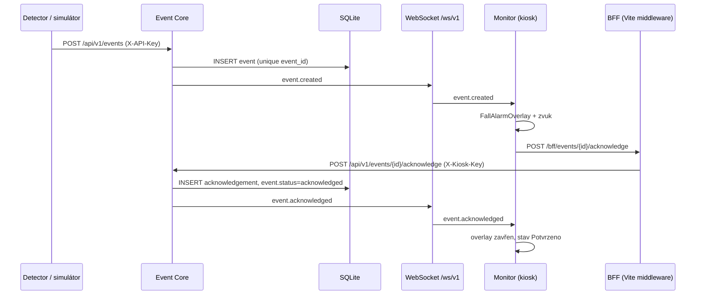

# EVENT_PIPELINE — Event Core

Last verified: 2026-07-30 (office incident clip E2E)

## Incident media (feature: `feat/incident-pipeline-release`)

Flow (office-tested with MediaMTX v1.11.3 playback):

1. `POST /api/v1/events` fall → WS `event.created` immediately (alarm does not wait for media)
2. `incident_clip_jobs` row PENDING; `snapshot_status`/`clip_status` = PENDING
3. Worker waits until `occurred_at + post_event_seconds` (default **30 s**), then localhost MediaMTX `/get`
4. Remux `+faststart`, ffprobe, SHA-256, JPEG snapshot at pre-roll offset (default **15 s**)
5. Atomic store under `runtime/incidents/<camera>/<YYYY-MM-DD>/<event-id>/`
6. WS `event.updated` / `snapshot_ready` / `clip_ready`
7. Serve via `GET /api/v1/events/{id}/snapshot` and `.../clip` (Range supported; no filesystem paths)

Camera aliases: `camera-122727` / `office-test-camera` → canonical **`office-63`** → MTX path **`office-test-camera`**.

Migration: `0003_incident_media`.

Verified against:

- cableguard-platform `main` commit `5400cb3`
- cableguard-monitor `main` commit `f085ef0`
- cableguard-detector `main` commit `c628a2f`

---

## REST endpointy (`/api/v1`, podle aktuálního main)

| Metoda | Path | Auth | Chování |
|---|---|---|---|
| `GET` | `/health` | — | `{ok, service, version}` |
| `GET` | `/status` | — | `{services[], open_events, heartbeat_timeout_sec}` |
| `GET` | `/status/history` | — | historie přechodů stavů (`service_id?`, `limit≤500`, `offset`) |
| `POST` | `/events` | `X-API-Key` (ingest) | **201** nový, **200** identický duplikát, **409** konflikt payloadu |
| `GET` | `/events` | — | filtrování `site_id/station_id/event_type/status/service_id`, `limit≤200` |
| `GET` | `/events/{event_id}` | — | detail nebo 404 |
| `POST` | `/events/{event_id}/acknowledge` | `X-Kiosk-Key` | **200** (první i identický opakovaný ack), **409** odlišný ack, **404** neexistující event |
| `POST` | `/heartbeats` | `X-API-Key` | upsert `service_health`, vrací `ServiceHealthRead` |

Chybějící/nenakonfigurovaný klíč → 401; placeholder secret v konfiguraci → 503 (vynuceno `core/secrets.py`).

`EventCreate`: `event_id`, `event_type`, `severity` (info|warning|alarm|critical), `site_id`, `station_id`, `camera_id?`, `service_id`, `created_at`, `risk_score?`, `snapshot_url?`, `clip_url?`, `algorithm_version?`, `model_sha256?`, `config_sha256?`, `payload_json?`.

## WebSocket (`WS /ws/v1`)

Envelope: `{ "type": string, "data": object, "sent_at": ISO-UTC }`. Bez auth (trusted LAN, viz SECURITY.md).

| type | Kdy | Data |
|---|---|---|
| `system.snapshot` | ihned po připojení klienta | `{services[], open_events, heartbeat_timeout_sec}` |
| `event.created` | pouze při skutečném insertu (ne duplikát) | EventRead **bez** `payload_json` |
| `event.acknowledged` | pouze při prvním acku | `{event_id, acknowledgement_id, acknowledged_by, kiosk_id, acknowledged_at, status}` |
| `service.updated` | heartbeat se stavem ≠ offline | ServiceHealthRead |
| `service.offline` | heartbeat s `status=offline` **nebo** timeout monitor | ServiceHealthRead |

## Idempotence

### Event idempotence

- DB unique constraint na `events.event_id`.
- Opakovaný POST se **stejným** payloadem (kanonicky: ingest `status` normalizován na `open`, `received_at` ignorováno) → 200, žádná WS zpráva.
- Opakovaný POST s **odlišným** payloadem → 409.
- Detektor/simulátor tedy může bezpečně retry-ovat bez duplicitních alarmů.
- Poznámka: re-POST téhož `event_id` po acknowledgi vrátí 409 (uložený stav je `acknowledged` vs. kanonický `open`) — retry okno publisheru musí být kratší než typický čas acku, nebo publisher 409 po úspěšném prvním doručení ignoruje.

### Acknowledge idempotence

- Unique na `acknowledgements.event_id` (jeden ack na event) + FK na events (migrace `0002`).
- Identický opakovaný ack (`acknowledged_by`, `kiosk_id`, normalizovaná `note`) → 200 s existujícím záznamem, žádná další WS zpráva.
- Odlišný ack na již potvrzený event → 409. Monitor na 409 reaguje refetchem eventu (synchronizace stavu, ne chyba pro operátora).

## SQLite persistence

Tabulky (`backend/app/db/models.py`, migrace `0001` + `0002`):

- `events` — unique `event_id`, plný payload + metadata verzí (`algorithm_version`, `model_sha256`, `config_sha256`)
- `service_health` — PK `service_id`, poslední heartbeat, flagy (`camera_connected`, `inference_running`, `relay_connected`)
- `service_status_history` — přechody stavů s `reason` (např. `heartbeat_timeout`)
- `acknowledgements` — unique `acknowledgement_id`, unique+FK `event_id`

SQLite v WAL režimu; soubor `data/cableguard.sqlite3` (gitignored). Bezpečný reset: `scripts/reset_development_database.ps1 -ConfirmReset`.

## Status / heartbeat

- Služby posílají `POST /heartbeats`; timeout **6 s** (`CABLEGUARD_HEARTBEAT_TIMEOUT_SEC`).
- `StatusMonitor` (background task, tick 1 s): služba bez heartbeatu déle než timeout → `offline` + zápis historie + `service.offline` na WS.
- Návrat heartbeatu → zpět `healthy` + `service.updated`; historie se zapisuje jen při změně stavu (žádné duplicitní offline záznamy).

## Sekvence: fall event → alarm → acknowledge

Dnešní producent na hraně `D` je `scripts/simulate_system.py` (CONFIRMED); reálný detektor přes `EventCorePublisher` je Phase 4 (EXPERIMENTAL na detector větvi `feature/fall-event-core-integration`).
